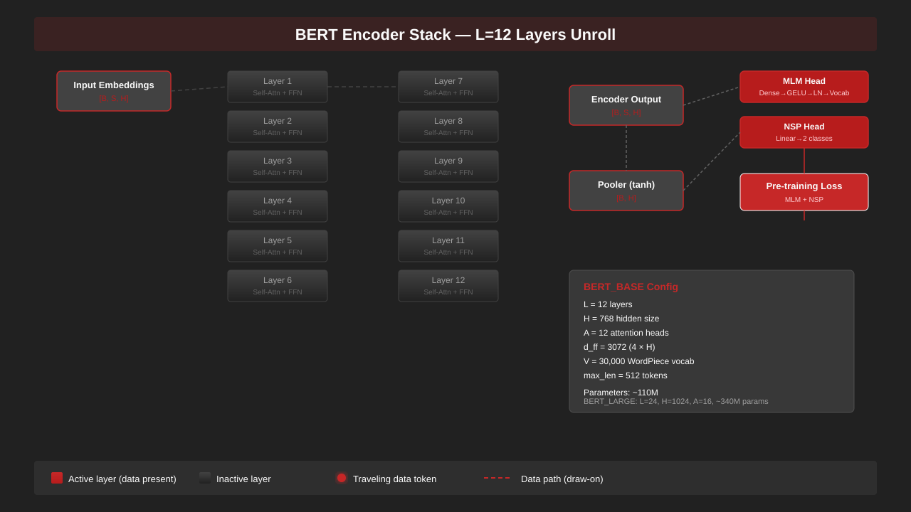
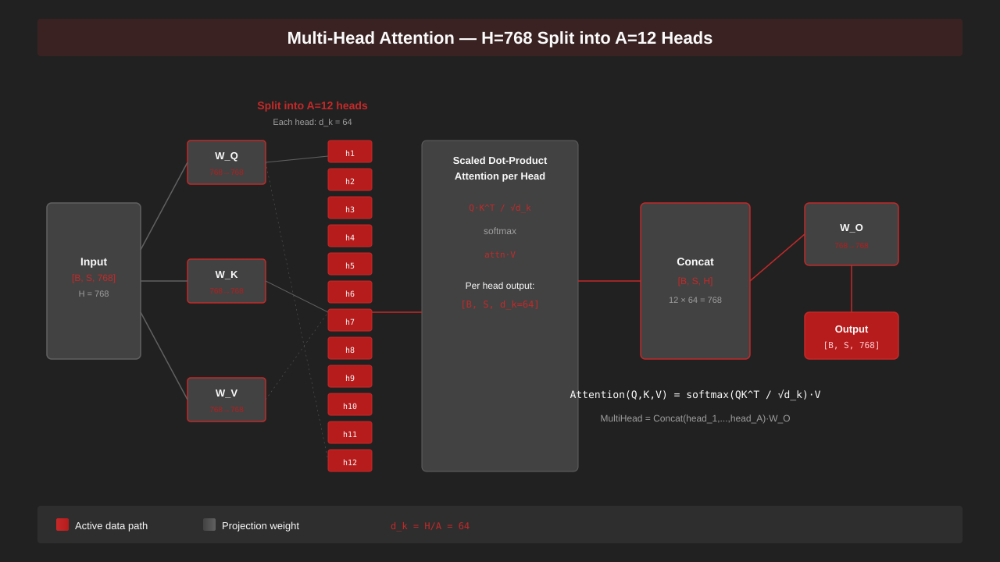
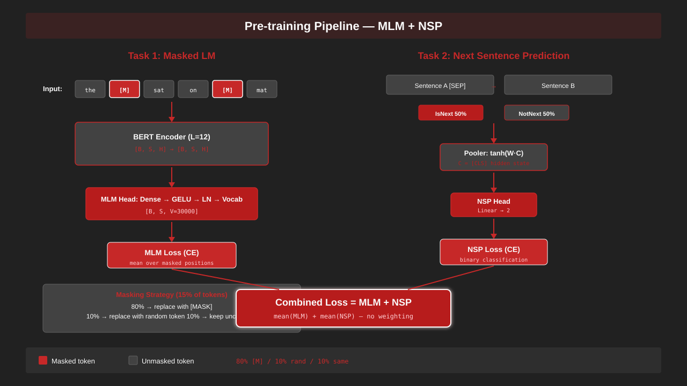
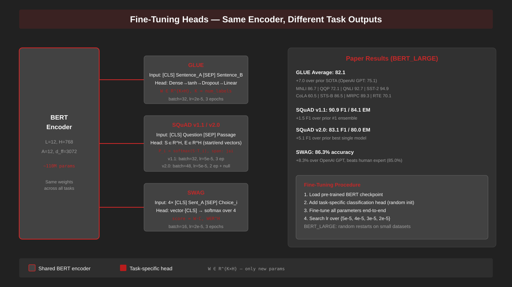
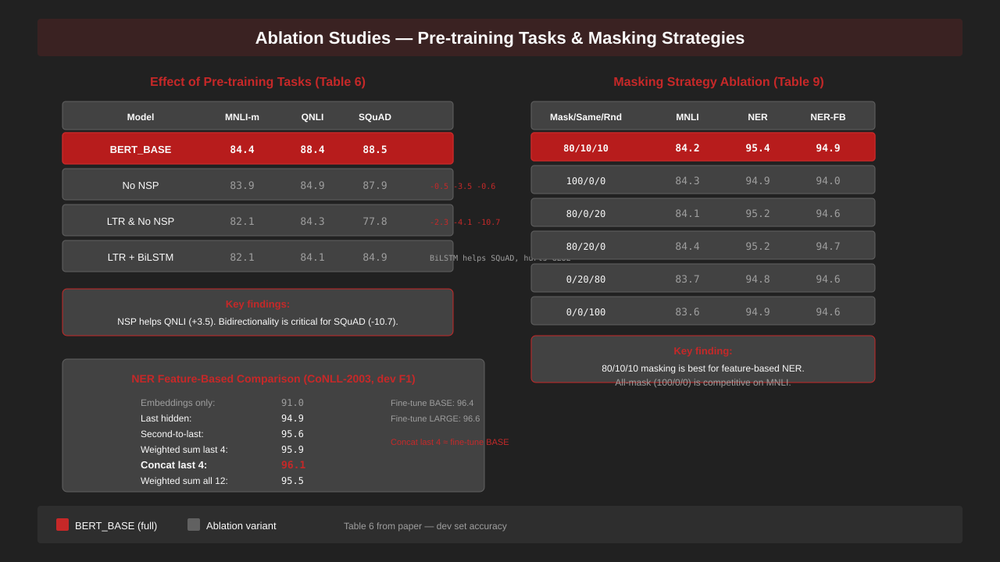
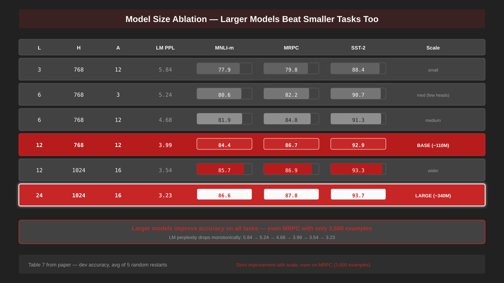

# bert-from-scratch

from-scratch PyTorch implementation of BERT (Devlin et al., 2019).

An encoder-only transformer that you pre-train with masked language modeling and next sentence prediction, then fine-tune on GLUE, SQuAD, and SWAG. Every component — attention, embeddings, optimizer, scheduler, heads — comes from the paper, not from a library wrapper.

## Project Tree

```
config/              bert config, pretrain config, finetune config, ablation configs
data/                wordpiece tokenizer, vocabulary builder, MLM/NSP data, GLUE/SQuAD/SWAG datasets, masking strategies
model/               bert model, embeddings, attention, encoder, pooler, MLM/NSP/QA/SWAG/classification heads, ablation variants
training/            adam optimizer, warmup+linear scheduler, pretrain trainer, finetune trainer, gradient accumulation
scripts/             pretrain, glue, squad, swag, ablation runners, visualization plots
eval/                accuracy, F1, precision, recall, Spearman, Matthews, GLUE/SQuAD/SWAG/NER evaluators
tests/               131 tests across 26 test files — shapes, losses, convergence, round-trips
assets/              architecture and results diagrams
```

## Architecture

BERT takes token + segment + position embeddings, passes them through L transformer encoder layers, and produces contextual representations for every token. A pooler extracts the [CLS] representation for classification tasks.



**Model configurations:**

| Model | L | H | A | d_ff | Parameters |
|-------|---|---|---|------|------------|
| BERT_BASE | 12 | 768 | 12 | 3072 | ~110M |
| BERT_LARGE | 24 | 1024 | 16 | 4096 | ~340M |

Input representation: `[CLS] token_A [SEP] token_B [SEP]` with segment IDs and position embeddings. Max sequence length is 512 tokens. Vocabulary is 30,000 WordPiece tokens.

### Multi-Head Attention

Each encoder layer splits the hidden state into A attention heads. Each head computes scaled dot-product attention independently. The heads concatenate and project back to H.



Formula: `Attention(Q,K,V) = softmax(QK^T / √d_k) · V` where `d_k = H/A = 64`.

Each encoder layer: multi-head attention → residual + LayerNorm → feed-forward (4H) → residual + LayerNorm. Dropout P_drop=0.1 on all sub-layers. Activation is GELU. Weight initialization is normal with std=0.02.

## Pre-Training

BERT uses two pre-training objectives on unlabeled text. The combined loss is the unweighted sum of mean MLM loss and mean NSP loss.



**Task 1 — Masked Language Modeling (MLM):** Mask 15% of WordPiece tokens. Of those, 80% get replaced with `[M]`, 10% get a random token, and 10% stay unchanged. The MLM head predicts the original tokens at masked positions. Loss is cross-entropy, averaged over masked positions only.

**Task 2 — Next Sentence Prediction (NSP):** Given sentence pairs, 50% are actual consecutive sentences (IsNext) and 50% are random (NotNext). The [CLS] representation feeds a binary classifier. Loss is cross-entropy.

**Pre-training hyperparameters:**

| Parameter | Value |
|-----------|-------|
| Batch size | 256 |
| Learning rate | 1e-4 |
| Optimizer | Adam (β1=0.9, β2=0.999) |
| Weight decay | 0.01 |
| Warmup steps | 10,000 |
| LR schedule | Linear decay |
| Dropout | 0.1 |
| Sequence length | 128 for 90% of steps, 512 for 10% |
| Total steps | 1,000,000 |

## Fine-Tuning

After pre-training, you add a task-specific head on top of BERT and fine-tune all parameters end-to-end. The encoder weights are the same across tasks — only the head changes.



### GLUE

Input: `[CLS] sentence_A [SEP] sentence_B [SEP]`. Head: `Dense → tanh → Dropout → Linear(K)`. Loss: `log(softmax(C·W^T))` where `W ∈ R^{K×H}`.

Hyperparameters: batch=32, 3 epochs, lr search over {5e-5, 4e-5, 3e-5, 2e-5}. BERT_LARGE uses random restarts on small datasets.

**Results (BERT_LARGE, Table 2):**

| Task | Score | Metric |
|------|-------|--------|
| MNLI (m/mm) | 86.7 / 85.9 | Accuracy |
| QQP | 72.1 | F1 |
| QNLI | 92.7 | Accuracy |
| SST-2 | 94.9 | Accuracy |
| CoLA | 60.5 | Matthews |
| STS-B | 86.5 | Spearman |
| MRPC | 89.3 | F1 |
| RTE | 70.1 | Accuracy |
| **Average** | **82.1** | — |

+7.0 over prior SOTA (OpenAI GPT: 75.1 average).

### SQuAD v1.1

Input: `[CLS] question [SEP] passage [SEP]`. Head: start vector `S ∈ R^H` and end vector `E ∈ R^H`. Start probability: `P_i = softmax(S·T_i)`. Span score: `S·T_i + E·T_j` where `j ≥ i`. Loss: sum of start and end cross-entropy.

Hyperparameters: batch=32, lr=5e-5, 3 epochs.

**Results (BERT_LARGE):** 90.9 F1 / 84.1 EM (dev). +1.5 F1 over prior #1 ensemble system.

### SQuAD v2.0

Same as v1.1, plus a no-answer span at [CLS]. Null score: `s_null = S·C + E·C`. Predict non-null if best span score > `s_null + τ`, where you tune τ on dev.

Hyperparameters: batch=48, lr=5e-5, 2 epochs.

**Results (BERT_LARGE):** 83.1 F1 / 80.0 EM (test). +5.1 F1 over prior best single model.

### SWAG

Input: 4 × `[CLS] sentence_A [SEP] continuation_i [SEP]`. Head: `score_i = w·C_i` where `w ∈ R^H`. Softmax over 4 choices. Loss: cross-entropy.

Hyperparameters: batch=16, lr=2e-5, 3 epochs.

**Results (BERT_LARGE):** 86.3% accuracy (test). +8.3% over OpenAI GPT. Beats human expert baseline (85.0%).

## Ablations

The paper runs controlled experiments to measure the contribution of each design choice.



### Pre-Training Tasks (Table 6)

Removing NSP hurts QNLI by 3.5 points. Switching from bidirectional MLM to left-to-right (LTR) hurts SQuAD by 10.7 F1 points. Adding a BiLSTM on top of LTR helps SQuAD (+7.1 F1) but hurts GLUE tasks.

### Model Size (Table 7)



Larger models improve accuracy on all tasks, including MRPC which has only 3,600 training examples. LM perplexity drops monotonically from 5.84 (L=3) to 3.23 (L=24, H=1024, A=16).

### Masking Strategies (Table 9)

The 80/10/10 split gives the best feature-based NER performance (94.9 F1). Replacing all masked tokens with [MASK] (100/0/0) is competitive on MNLI (84.3 vs 84.2). Leaving all masked tokens unchanged (0/0/100) drops MNLI to 83.6.

### NER Feature-Based (Table 8)

Concatenating the last 4 hidden layers gives 96.1 dev F1 on CoNLL-2003 NER — close to fine-tuning BERT_BASE (96.4). Single-layer features max out at 95.6 (second-to-last layer).

## Data Pipeline

- **Tokenizer:** WordPiece with 30,000-token vocabulary. Special tokens: `[CLS]`, `[SEP]`, `[MASK]`, `[PAD]`, `[UNK]`.
- **MLM data:** Mask 15% of tokens per sequence. Configurable masking strategy (80/10/10 default).
- **NSP data:** 50% IsNext sentence pairs, 50% NotNext. Segment IDs distinguish sentence A from sentence B.
- **GLUE datasets:** Processors for CoLA, SST-2, MRPC, STS-B, QQP, MNLI, QNLI, RTE, WNLI.
- **SQuAD:** Question-passage pairs with start/end answer positions. v2.0 adds unanswerable questions.
- **SWAG:** 4-choice sentence completion with adversarial negatives.

## Installation

```bash
pip install -r requirements.txt
```

Dependencies: PyTorch, pytest.

## Usage

**Pre-training:**

```bash
python scripts/pretrain.py --L 12 --H 768 --A 12 --V 30000 --max_len 512 --batch_size 256 --lr 1e-4 --warmup_steps 10000 --total_steps 1000000
```

**GLUE fine-tuning:**

```bash
python scripts/glue.py --task mnli --L 12 --H 768 --A 12 --batch_size 32 --lr 2e-5 --epochs 3
```

**SQuAD fine-tuning:**

```bash
python scripts/squad.py --L 12 --H 768 --A 12 --max_len 384 --batch_size 32 --lr 5e-5 --epochs 3
```

**SWAG fine-tuning:**

```bash
python scripts/swag.py --L 12 --H 768 --A 12 --max_len 128 --batch_size 16 --lr 2e-5 --epochs 3
```

**Ablation runs:**

```bash
python scripts/ablation_steps.py --steps 100
python scripts/step_evaluator.py --checkpoint_dir checkpoints --output results.json
```

**Visualization:**

```bash
python scripts/plot_glue.py --results results.json --output glue_results.png
python scripts/plot_model_size.py --results size_results.json --output model_size.png
```

## Testing

```bash
pytest tests/ -v
```

131 tests cover: output shapes, loss values, masking correctness, gradient flow, save/load round-trips, convergence on small models, metric calculations, and evaluator accuracy.

## Reference

Devlin, J., Chang, M.-W., Lee, K., & Toutanova, K. (2019). BERT: Pre-training of Deep Bidirectional Transformers for Language Understanding. NAACL-HLT 2019. arXiv:1810.04805v2.
